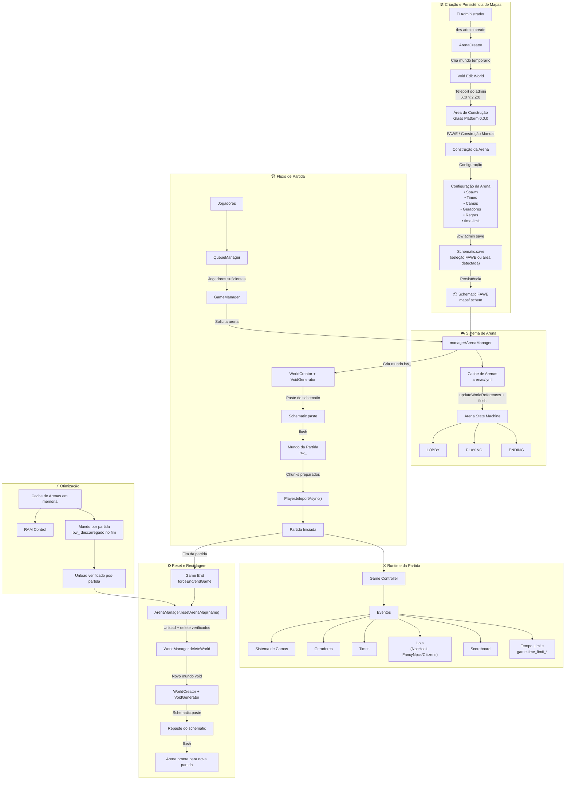

# BedWars Architecture — AdvancedSlimePaper World System

## Visão Geral

Este documento define a arquitetura técnica oficial do sistema de mapas do plugin BedWars.
O objetivo é garantir um sistema escalável, isolado e performático, evitando a carga desnecessária de WorldEdit/Schematics durante o tempo de execução (runtime) de partidas.

> ⚠️ **Sistemas de mundos — IMPORTANTE.** O sistema **ativo** em runtime é o baseado em **schematic**: `manager/ArenaManager` + `world/WorldManager` + `world/Schematic`. As arenas são persistidas em `arenas/<nome>.yml`, os mapas como schematics FAWE em `maps/`, e os mundos de partida `bw_<nome>` são recriados via unload/delete verificado + `VoidGenerator` + paste do schematic a cada reset (`ArenaManager.resetArenaMap`). O sistema **Slime/ASP descrito nos diagramas abaixo é uma implementação paralela e NÃO ativa** (`arena/ArenaManager`, `reset/ResetManager`, `slime/*`, `template/*`, `world/SimpleWorldManager`) — não está conectado no `BedWarsPlugin.onEnable()`. Alterações devem priorizar o sistema Schematic; o Slime não deve ser tratado como produção.

## Pilares Tecnológicos

- **Schematic FAWE (sistema ATIVO):** Núcleo de persistência de mapas. Arenas em `arenas/<nome>.yml`, mapas como `.schem`/`.bwmap` em `maps/`.
- **FAWE (FastAsyncWorldEdit):** Restrito exclusivamente à fase de edição administrativa e load/save/restore — nunca em runtime.
- **Isolamento:** Cada partida roda em seu próprio mundo `bw_<nome>` recriado do schematic a cada reset.
- **Persistência:** YAML por arena + schematic por mapa; sem templates Slime em produção.

---

## Arquitetura Geral (Fluxo de Dados)



---

## Estrutura de Código (Package Map)

A organização segue padrões de alta coesão e baixo acoplamento:

```text
dev.sebastianjnuwu.bedwars
├── api/            # Interfaces e Eventos públicos para extensões
├── arena/          # Lógica de Arena e estados de instância
├── command/        # Sistema de comandos (BaseCommand, SubCommand)
├── editor/         # Lógica específica do editor de arenas
├── game/           # Core do jogo e estados de partida
├── hook/           # Integrações com backends de NPC (FancyNpcs, Citizens)
├── lang/           # Internacionalização (lang/pt_BR.yml) via LangManager
├── libs/           # Código embarcado (bStats)
├── listener/       # Eventos do Bukkit (Arena, Game, UI)
├── manager/        # Managers singleton (ArenaManager, GameManager, etc.)
├── model/          # POJOs e modelos de dados
├── queue/          # Gerenciamento de filas de espera
├── reset/          # Lógica de descarte de instâncias após partida
├── session/        # Sessões de edição ativa
├── shop/           # Loja (ShopManager, ShopCategory, ShopItem, ShopGui) e NPCs
├── slime/          # Wrapper para SlimeWorld e carregamento de templates (NÃO ativo)
├── template/       # Gerenciamento de persistência de templates (NÃO ativo)
├── ui/             # Interfaces de usuário (GUIs)
├── util/           # Utilitários (LocationUtil)
└── world/          # Abstrações de Mundo (WorldManager, VoidGenerator, Schematic)
```

---

## Detalhes de Implementação

### 1. Sistema de Edição (`editor/`)

Utiliza `ArenaCreator` para gerar mundos `VOID` sem física.
O `ArenaEditorValidator` garante que a arena possua todos os requisitos (spawns, camas, geradores) antes de permitir o `save`.

### 2. Sistema de Mundos (`world/`, `manager/`)

Sistema **ativo** baseado em schematic:

- `world/WorldManager`: cria mundos void (`bw_<nome>` via `WorldCreator` + `VoidGenerator`), salva/copia templates e descarrega mundos com verificação.
- `world/Schematic`: captura e aplica schematics FAWE (`.schem`/`.bwmap`) em `maps/` — usado apenas no load/save/restore, nunca em runtime.
- `manager/ArenaManager`: `resetArenaMap(name)` executa o ciclo de reset — unload + delete verificados (`WorldManager.deleteWorld`) → novo mundo void → `Schematic.paste` → `flush`. Retorna `boolean`; em falha loga `log.arena_manager.reset_error`.

Implementação paralela **NÃO ativa**: `world/SimpleWorldManager`, `slime/SlimeWorldManager`, `slime/SlimeManager` (ver aviso no início).

### 3. Gerenciamento de Partidas (`game/`, `arena/`)

O `GameManager` coordena a transição entre `GameState` (READY -> STARTING -> PLAYING -> ENDING -> RESETTING).
O sistema **ativo** descarta o mundo da partida ao fim: `Game.forceEnd()`/`endGame()` chama `ArenaManager.resetArenaMap(name)`, que faz unload + delete verificados do mundo `bw_<nome>` (`WorldManager.deleteWorld`) → novo mundo void (`WorldCreator` + `VoidGenerator`) → `Schematic.paste` → `flush`. Isso garante integridade total para a próxima partida. O `ResetManager` (sistema Slime, não ativo) não é usado em produção.

### 4. NPCs da Loja (`hook/`, `shop/`)

Os NPCs das lojas usam o contrato `NpcHook` (`hook/NpcHook`) com duas implementações: `FancyNpcsHook` e `CitizensHook` (via reflexão — Citizens **não** é dependência de compilação). A escolha é feita em `ShopNpcManager.resolveHook` a partir de `config.yml` `npc-backend` (`auto` = tenta FancyNpcs primeiro e, se ausente, usa Citizens; ou força `fancynpcs`/`citizens`). O listener de interação registrado em `BedWarsPlugin.onEnable` depende do hook ativo (`NpcListener` para FancyNpcs, `CitizensNpcListener` para Citizens) e ambos delegam a `ShopNpcManager.openShop`. NPCs são spawnados no início da partida/edição e removidos ao final; no Citizens o nome visível é o `displayName` configurado e a skin usa o trait `SkinTrait`.

### 5. Tempo limite de partida

`time-limit` (segundos, `0` = sem limite) é um campo por arena, lido em `manager/ArenaManager` no load. Durante `GameState.PLAYING`, `Game.handleTimeLimit` emite avisos aos 60s/30s/10..1s restantes (`game.time_limit_warning`) e, ao estourar, `forceTimeLimitEnd` decide o vencedor na ordem: mais jogadores vivos → cama intacta → mais abates → empate (`endGame`/`forceEnd` + `game.time_limit_*`).

---

## Regras de Desenvolvimento (Obrigatório)

1. **Zero WorldEdit em Runtime:** Proibido usar WE para limpar arena.
2. **Async Operations:** Sempre usar `TeleportAsync` e operações de mundo assíncronas para não travar a thread principal.
3. **Imutabilidade de Template:** Templates são *read-only*. Partidas SEMPRE rodam em cópias (instâncias).
4. **Descarregamento Seguro:** Partidas encerradas devem disparar o ciclo de `RESETTING` imediatamente.
5. **Clean Architecture:** Novas funcionalidades devem preferir a injeção dos Managers existentes.
6. **Imports no topo:** Referencie tipos pelo **nome curto** com um único `import` no topo do arquivo — nunca hardcodar fully-qualified names inline no corpo. Exceções: nome clash real (importar o mais usado e qualificar o raro) e reflection/string (`Class.forName("...")`).
